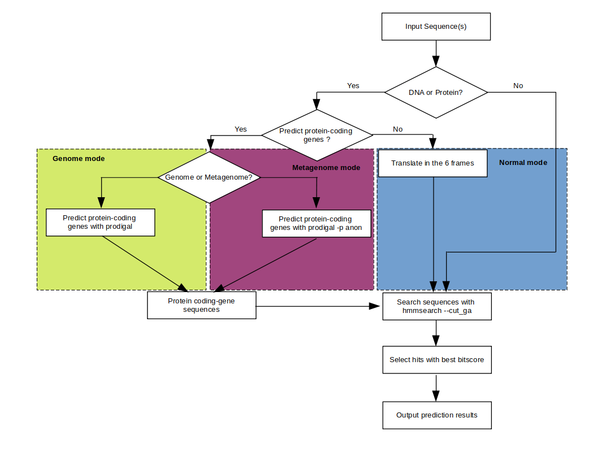

# hkgfinder

*Find housekeeping genes in prokaryotic (meta)genomes*

[](https://pypi.org/project/hkgfinder)
[](https://pypi.org/project/hkgfinder)
[](https://pypi.org/project/hkgfinder)
[](https://pypi.org/project/hkgfinder)
[](https://pypi.org/project/hkgfinder)
[](https://www.gnu.org/licenses/MIT)


## 🗺️ Overview
hkgfinder is a fast and accurate housekeeping gene finder and classifier. hkgfinder can run on raw sequences, genomes and metagenomes. The novel value of this method lies is in its ability to directly predict and classify gene sequences into housekeeping gene families at a high specificity and sensitivity, while being also faster than genome and metagenome annotator on genome and metagenome data.


## How hkgfinder works


## 🔧 Installing

hkgfinder can be installed directly from [PyPI](https://pypi.org/project/hkgfinder).

```console
$ pip install hkgfinder
```

## Test

* Type `hkgfinder -h` and it should output something like:

```
usage: hkgfinder [options] [<FILE>]

options:
  -o [FILE]      output result to FILE [stdout]
  -g             activate genome mode [false]
  -m             activate metagenome mode [false]
  --faa FILE     output matched protein sequences to FILE [false]
  --fna FILE     output matched DNA sequences to FILE [false]
  -s             output sequences in file by gene [false]
  -t INT         number of threads [1]
  -q             decrease program verbosity
  -d             enable debug mode
  -v, --version  show program's version number and exit
  -h, --help     show this help message and exit
```


## Invoking hkgfinder

```
hkgfinder --faa housekeeping.faa --fna housekeeping.fna file.fa.gz
```

* hkgfinder supports gzip, lzma, bz2 and zstd compressed files.
  
## ⚠️ Issue Tracker

Found a bug ? Have an enhancement request ? Head over to the [Issue Tracker](https://github.com/Ebedthan/hkgfinder/issues) if you need to report
or ask something. If you are filing in on a bug, please include as much
information as you can about the issue, and try to recreate the same bug
in a simple, easily reproducible situation.


## ⚖️ License

[MIT](https://github.com/Ebedthan/hkgfinder/blob/main/LICENSE).


## Author

* [Anicet Ebou](https://orcid.org/0000-0003-4005-177X)

